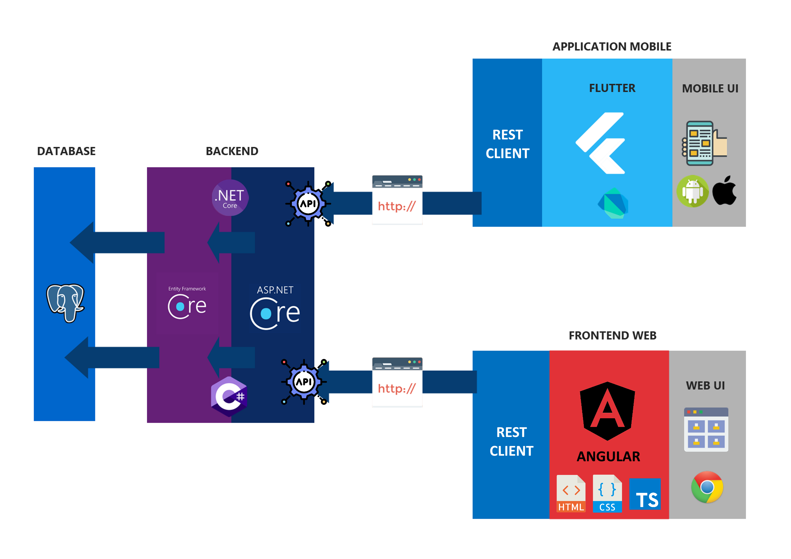

# Pitch

Système d'information de gestion de stocks de nourriture. 

- Stock de nourriture
- Gestion (création et import) des recettes (nb de personnes, durée)
- Planification des repas (ICAL)
- Génération de listes de courses
- Moteur de recherches de recettes
- Système de recommendation de recettes (possibilité de ML)

Bob veut des crêpes. Il ouvre sa recette de crêpe sur son SI Fork Eat. Le SI lui génère une liste de courses comportant : farine, oeufs, car il possède déjà du lait, et du sucre.

Après avoir suivi la recette sur son application mobile Fork Eat, il valide la finalisation de la recette, ce qui met à jours sont stock de produits.

Idées en vracs : 

- ⚠ Certain produits n'ont pas de dates de péremption
- Balance connectée
- Avoir une précision du suivi de la quantité des ingrédients personnalisable
- Assistant vocaux
- Intégration d'un système de la nutrition
- Sharding : accès aux recettes d'autres instances

# Features

- Planification de repas
- Gestion des stocks du frigo avec prise en compte de la date de péremption
- Bonne UI/UX, bonne ergonomie
- App mobile et App Web selon les cas d'utilisation
- Auto-hébergeable, respectueux de la vie privée
- Open source

# Etude de marché

# Stack

- Application Mobile : Flutter
- Front Web : Angular
- Back : .NET
- Prototype UI : Figma
- RDMBS : Postgres (support natif de Full Text Search)

# Répartition 

- A Equipe Back : Marion + Arsène + Maud
- B Equipe Front : Carine + JM (support Marion et Arsène)
- C Equipe ML : Carine + Maud
- D Equipe Mobile : JM
- E Equipe Maquette : Maud + Carine + Thomas
- F Equipe Embarqué : Thomas + JM + (support Marion)
- G Equipe Infra : Thomas

Chef de Projet : Maud

# Livrables

|                                                           | V.0 | V.1 | V.2 | V.3+ |
|-----------------------------------------------------------|-----|-----|-----|------|
|                                                           |     |     |     |      |
| **Infra**                                                 | -   | -   | -   | -    |
| Pipelines CI/CD sur AMD64                                 | G   |     |     |      |
| Pipelines CI/CD sur ARM64                                 |     |     |     | G    |
| Build CI sur ARM64                                        | G   |     |     |      |
| **Backend**                                               | -   | -   | -   | -    |
| Logique inventaire                                        | A   |     |     |      |
| Logique de recettes : insérer                             | A   |     |     |      |
| Logique de recettes : importer                            |     |     | A   |      |
| Moteur de recettes : recherche par ingrédient             | A   |     |     |      |
| Moteur de recettes : full text search                     |     | A   |     |      |
| Moteur de recettes : recommandation naïve                 |     | A   |     |      |
| Gestion des codes barre                                   |     | A   |     |      |
| Alerte péremption                                         |     |     | A   |      |
| Alerte péremption : modulaire                             |     |     |     | A    |
| Moteur de recettes : nutrition et contrainte alimentaires |     |     | A   |      |
| Planification des repas                                  |     |     |     | A    |
| **Machine Learning**                                      |     |     |     |      |
| Moteur de recette : machine learning                      |     |     |     | C    |
| **Application mobile**                                    | -   | -   | -   | -    |
| UI Gestion Stock                                          | D   |     |     |      |
| UI Gestion recette                                        | D   |     |     |      |
| Date de péremption via datepicker                         | D   |     |     |      |
| Date de péremption via vocal                              |     |     |     | D    |
| Scan des produits                                         |     |     | D   |      |
| Alerte péremption                                         |     |     | D   |      |
| Alerte péremption : modulaire                             |     |     |     | D    |
| Planification des repas                                  |     |     |     | D    |
| **Web UI**                                                | -   | -   | -   | -    |
| UI Gestion Stock                                          |     | B   |     |      |
| UI Gestion recette                                        |     | B   |     |      |
| Alerte péremption                                         |     |     | B   |      |
| Alerte péremption : modulaire                             |     |     |     | B    |
| Planification des repas                                  |     |     |     | B    |
| **Embarqué**                                              | -   | -   | -   | -    |
| Scan via caméra                                           |     | F   |     |      |
| Information du scan sur écran                             |     |     | F   |      |
| Pèse aliment                                              |     |     |     | F    |
| Date de péremption via vocal                              |     |     |     | F    |
| Suppression via vocal                                     |     |     |     | F    |

