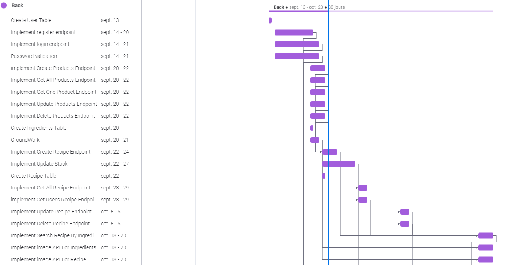
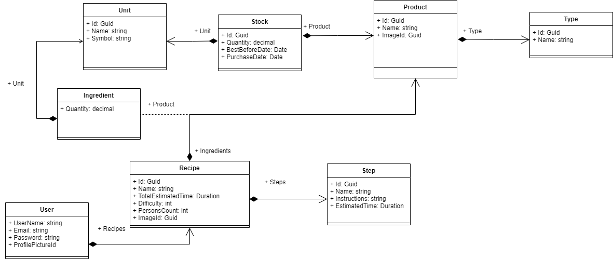

# Pitch

Système d'information de gestion de stocks de nourriture. 

- Stock de nourriture
- Gestion (création et import) des recettes (nb de personnes, durée)
- Planification des repas (ICAL)
- Génération de listes de courses
- Moteur de recherches de recettes
- Système de recommendation de recettes (possibilité de ML)

Bob veut des crêpes. Il ouvre sa recette de crêpe sur son SI Fork Eat. Le SI lui génère une liste de courses comportant : farine, oeufs, car il possède déjà du lait, et du sucre.

Après avoir suivi la recette sur son application mobile Fork Eat, il valide la finalisation de la recette, ce qui met à jours sont stock de produits.

Idées en vracs : 

- ⚠ Certain produits n'ont pas de dates de péremption
- Balance connectée
- Avoir une précision du suivi de la quantité des ingrédients personnalisable
- Assistant vocaux
- Intégration d'un système de la nutrition
- Sharding : accès aux recettes d'autres instances

# Features

- Planification de repas
- Gestion des stocks du frigo avec prise en compte de la date de péremption
- Bonne UI/UX, bonne ergonomie
- App mobile et App Web selon les cas d'utilisation
- Auto-hébergeable, respectueux de la vie privée
- Open source

# Etude de marché

## Le choix du nom et logo

Nous avons choisi comme nom d'application ForkEat.

Cependant après des recherches, nous nous sommes rendu compte que le nom était déjà utilisé en Asie par un restaurant. Cela pourrait être problématique étant donné que le nom est utilisé dans le domaine de l'alimentaire. 
Si nous prenons en compte que le projet est à but non lucratif et n'a pas vocation à devenir disponible en Asie, le choix du nom ForkEat n'est pas un problème.

Les noms de domaine : forkeat.com et forkeat.fr ne sont pas utilisés.
D'après l'INPI aucune entreprise française utilise le nom ForkEat.
Le nom ForkEat n'est pas pégoratif envers une entité quelconque.

En fonction des paramètres évoqués ci-dessus nous en avons conclus que l'utilisation de nom ForkEat ne pose pas de problème.

Le logo sera réalisé par un membre de l'équipe. 

## Caractéristiques générales du marché

Notre plateforme permet d'optimiser la consommation pour limiter le gachis et les déchets. Il est donc susceptible d'attirer les gens ayant une conviction écologique. Cette tendance est de plus en plus grandissante de nos jours.

Les français sont de plus en plus attentifs à leurs alimentations, et on remarque l'apparition de nombreux services ou produits encourageant les consommateurs à mieux et plus cuisiner chez eux, plutot que d'acheter des plats tout préparés (explosions de la popularité d'hellofresh ou quitoque). Notre application ne proposera pas de service de livraison, mais permet tout de même de répondre à la question classique : "qu'est ce qu'on mange ce soir ?" que redoutent tous les foyers. 

De plus, notre application sera plus attractive que les services de livraisons pour les personnes soucieuse du zéro déchets, qui souhaitent par exemple diminuer les emballages en leur permettant notemment d'aller faire leurs courses où ils le souhaitent, comme dans des magasins de vracs.

Enfin, comme notre application sera auto-hebergeable, les utilisateurs soucieux de leurs informations personnelle et de la protection de leurs vie privée pourront être rassurés.

## Délimitation de la zone de marché

Un outil comme forkEat n'a pas de réelle limite géographique s'il est traduit au minimum en anglais. En effet, un outil de gestion de nourriture, de stock et de recettes peut être utile n'importe où et être utilisé par n'importe qui. 

Cependant, chaque pays a sa propre culture culinaire. Pour les pays européens, il est probable qu'aucune adaptation ne soit necessaire, car nous avons une culture culinaire commune et nous avons chacun importés et exportés nos recettes dans les pays proches. 

Pour le marché mondial, il sera sans doute necessaire de nous adapter plus en profondeur. 
Notamment avec l'outil de proposition de recettes, par exemple, nous n'utiliserons sans doute pas les même API pour proposer des idées de plats, car la différence de culture sera trop grande pour que l'application soit populaire sans adaptation.
De la même manière, les produits proposés de base dans l'application ne devront pas être les même, les fruits sont par exemple un produit de luxe au Japon, ou l'intolérance au lactose touche beaucoup plus les personnes habitants en Asie que celles en Europe.

## Taille du marché

Pour la France : 
Selon une étude récente, 55% des foyers français utilisent des applications de gestion de courses ce qui représente environ 29 000 consommateurs en 2021. De plus, les français se préoccupent de plus en plus de ce qu'ils mangent et ont tendance à plus cuisiner, ayant perdu confiance dans les plats tout préparés. Ainsi, notre application permettant de réunir ses propres recettes en un même endroit et d'en proposer en fonction de ses envies et de ses goûts permettra, en partie, de trouver plus facilement des recettes et d'encourager les personnes à cuisiner des plats qui leurs font envie.
Enfin, la quetion du gaspillage alimentaire est de plus en plus présente chez les jeunes français (pour donner un ordre d'idée, 40% des foyers français ont tendance à faire attention au gâchis), et la proposition de recette en fonction d'ingrédients, priorisant notamment les ingrédients les plus proches de leurs date de péremptions, permettra d'y répondre.

Pour l'Europe : 
Ces dernière questions se posent aussi en Europe, car la plupart des pays évoluent vers une alimentation plus responsable. On pourrait s'attendre à un nombre potentiel de clients similaire à l'échelle de l'europe, en diminuant les chiffres dû à une différences dans les préférences d'alimentations, soit 45% des foyers européens pourraient être interessés par notre application.

Pour le monde : 
A l'échelle du monde l'estimation est plus difficile à faire, car cela dépendra énormément des pays et de notre réussite à adapter l'application à des cultures culinaires différentes.

## Segmentation du marché

Le marché est segmenté en plusieurs parties. Il existe différentes applications permettant gérer certains aspects tels que :

- Planification de repas
- Gestion des stocks du frigo avec ou sans prise en compte de la date de péremption
- Carnet de recettes

Cependant aucune de ces fonctionnalitées ne sont regroupées en une même application. Ainsi il n'y a pas de communication entre le carnet des recettes en fonction de la date des péremptions des aliments de notre frigo. 
C'est donc cet objectif que nous avons pensé l'application. Elle a pour but de centraliser toutes nos interractions dans notre cuisine afin d'éviter le gaspillage alimentaire.

## La concurrence

Voici une analyse de la concurrence sur le marché de la gestion de frigo, sur la zone géographique mondiale

| Concurrent                                                                                                          | Description                                                                                              | Forces et faiblesses                                                                                                                                                                                                                                                                                                                        |
| ------------------------------------------------------------------------------------------------------------------- | -------------------------------------------------------------------------------------------------------- | ------------------------------------------------------------------------------------------------------------------------------------------------------------------------------------------------------------------------------------------------------------------------------------------------------------------------------------------- |
| [Fridge](https://github.com/ayns01/Fridge)   :star: 0   :date: 22 Jun 2019                                            | Avertisseur de date de péremption                                                                        | + UI sympa    - Application iOS uniquement    - Pas Scan du code barre par caméra   + Notion de frigo (avec gestion du stock)   - Gestion de la date de péremtion manuelle   - Pas de planification des recettes   - Pas de carnet de recettes                                                                      |
| [exDateMan](https://github.com/Bernd-L/exDateMan)   :star: 3   :date: 29 Aug 2018                                     | Avertisseur de date de péremption                                                                        | - Pas d'application    - Pas Scan du code barre par caméra   + Notion de frigo (avec gestion du stock)   - Gestion de la date de péremtion manuelle   - Pas de planification des recettes   - Pas de carnet de recettes                                                                                                 |
| [Nutrivali-app](https://github.com/wiltonribeiro/nutrivali-app)   :star: 13   :date: Jan 22 2019                      | Avertisseur de date de péremption                                                                        | + Scan du code barre par caméra   + UI sympa    + Application iOS / Android    - Pas de notion de frigo (pas de gestion du stock)   - Gestion de la date de péremtion manuelle   - Pas de planification des recettes   - Pas de carnet de recettes                                                                  |
| [McHacks2020](https://github.com/AmandaBoatswain/McHacks2020/)   :star: 2   :date: 3 Feb 2020                         | Avertisseur de date de péremption                                                                        | + Scan du code barre par caméra   - UI basique    - Pas de notion de frigo (pas de gestion du stock)   - Gestion de la date de péremtion manuelle   - Pas de planification des recettes   - Pas de carnet de recettes                                                                                                   |
| [RecipeSage](https://github.com/julianpoy/RecipeSage)   :star: 101   :date: 18 Feb 2018                               | Gestionnaire de recettes, un planificateur de repas et un organisateur de listes d'achats collaboratifs. | + Parser pour importer des recettes de plusieurs sources   + Gestionnaire de recettes avec planification   - UI basique    - Pas de notion de frigo (pas de gestion du stock)   - Pas de gestion de la date de péremption   - Pas d'application mobile   - Ajout manuel des produits (pas de scan des codes barres) |
| [JOW](https://play.google.com/store/apps/details?id=com.wishop.dev.jow&hl=en_US&gl=US)   DL 1 000 000   :date: ? | Gestionnaire de recettes, un planificateur de repas et préparation de la liste des achats                | + Gestionnaire de recettes avec planification   + UI sympa    - Pas de notion de frigo (pas de gestion du stock)   - Pas de gestion de la date de péremption   + Application mobile   + Préparation d'une liste de course et achat automatique vie le site d'une enseigne partenaire   - Solution commerciale                                                                  |
| [ForkEat](https://github.com/ForkEat)      :date: 13 Sep 2021 | Gestionnaire de recettes, gestionnaire de date de peremption, recommendation de repas, plannificateur de repas, générateur de liste de courses.|   + UI sympa    + Auto-hebergeable donc respectueux de la vie privée   + Gestion des dates de péremption   + Application mobile   + Préparation d'une liste de course   + Plannification de recettes   + Recommmendation de repas en fonction des goûts et des ingrédients disponibles   + scann de code barre pour plus de facilité   - Liste de course générée mais les produits ne sont pas achetés automatiquements                                                         |

# Stack

- Application Mobile : Flutter
- Front Web : Angular
- Back : .NET
- Prototype UI : Figma
- RDMBS : Postgres (support natif de Full Text Search)

# Répartition 

- A Equipe Back : Marion + Arsène + Maud
- B Equipe Front : Carine + JM (support Marion et Arsène)
- C Equipe ML : Carine + Maud
- D Equipe Mobile : JM
- E Equipe Maquette : Maud + Carine + Thomas
- F Equipe Embarqué : Thomas + JM + (support Marion)
- G Equipe Infra : Thomas

Chef de Projet : Maud

# Livrables

La version V0 peut être considérer comme MVP

|                                                           | V.0 | V.1 | V.2 | V.3+ |
| --------------------------------------------------------- | --- | --- | --- | ---- |
|                                                           |     |     |     |      |
| **Infra**                                                 | -   | -   | -   | -    |
| Pipelines CI/CD sur AMD64                                 | G   |     |     |      |
| Pipelines CI/CD sur ARM64                                 |     |     |     | G    |
| Build CI sur ARM64                                        | G   |     |     |      |
| **Backend**                                               | -   | -   | -   | -    |
| Logique inventaire                                        | A   |     |     |      |
| Logique de recettes : insérer                             | A   |     |     |      |
| Logique de recettes : importer                            |     |     | A   |      |
| Moteur de recettes : recherche par ingrédient             | A   |     |     |      |
| Moteur de recettes : full text search                     |     | A   |     |      |
| Moteur de recettes : recommandation naïve                 |     | A   |     |      |
| Gestion des codes barre                                   |     | A   |     |      |
| Alerte péremption                                         |     |     | A   |      |
| Alerte péremption : modulaire                             |     |     |     | A    |
| Moteur de recettes : nutrition et contrainte alimentaires |     |     | A   |      |
| Planification des repas                                   |     |     |     | A    |
| **Machine Learning**                                      |     |     |     |      |
| Moteur de recette : machine learning                      |     |     |     | C    |
| **Application mobile**                                    | -   | -   | -   | -    |
| UI Gestion Stock                                          | D   |     |     |      |
| UI Gestion recette                                        | D   |     |     |      |
| Date de péremption via datepicker                         | D   |     |     |      |
| Date de péremption via vocal                              |     |     |     | D    |
| Scan des produits                                         |     |     | D   |      |
| Alerte péremption                                         |     |     | D   |      |
| Alerte péremption : modulaire                             |     |     |     | D    |
| Planification des repas                                   |     |     |     | D    |
| **Web UI**                                                | -   | -   | -   | -    |
| UI Gestion Stock                                          |     | B   |     |      |
| UI Gestion recette                                        |     | B   |     |      |
| Alerte péremption                                         |     |     | B   |      |
| Alerte péremption : modulaire                             |     |     |     | B    |
| Planification des repas                                   |     |     |     | B    |
| **Embarqué**                                              | -   | -   | -   | -    |
| Scan via caméra                                           |     | F   |     |      |
| Information du scan sur écran                             |     |     | F   |      |
| Pèse aliment                                              |     |     |     | F    |
| Date de péremption via vocal                              |     |     |     | F    |
| Suppression via vocal                                     |     |     |     | F    |

Voici le diagramme de Gantt qui est mise à jour régulièrement afin de suivre l'évolution de chaque personne du projet. La première version du projet (V0) est prévue pour lq semaine du 20 octobre.
Pour information toutes ses informations sont disponible sur monday.com, si vous souhaitez y avoir accès, n'hésitez pas à nous faire signe.

# Diagramme UML du modèle de donnée métier

